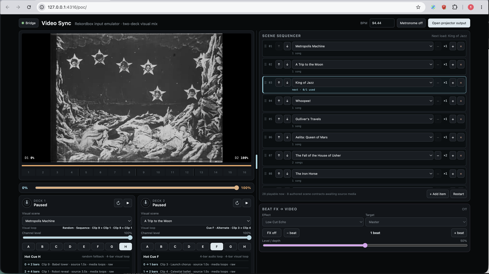
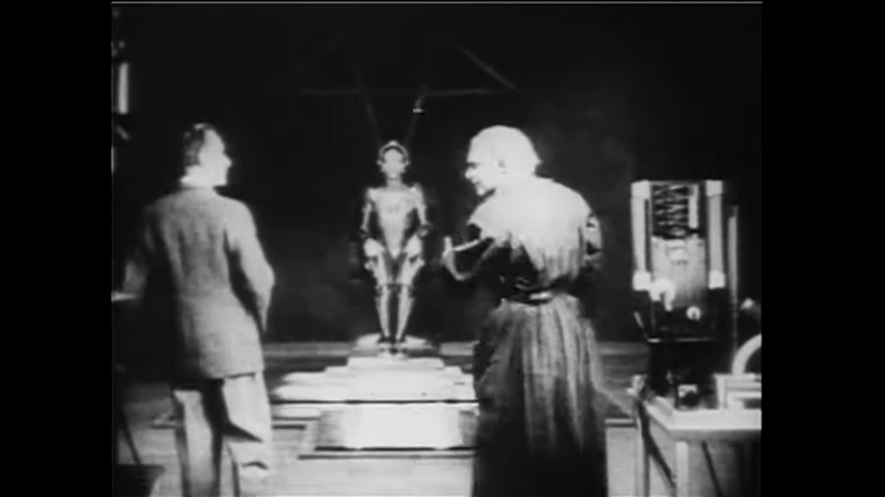
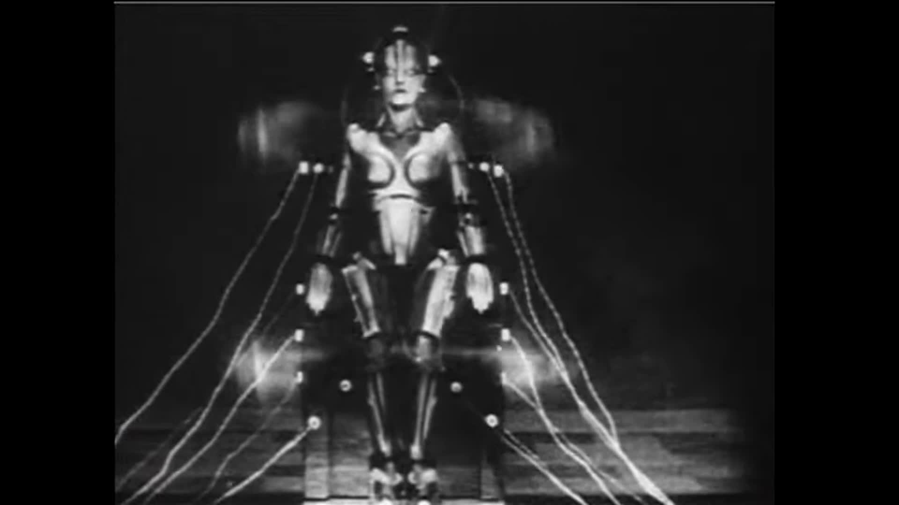
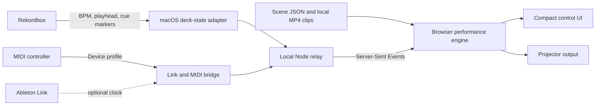

# Video Sync

Low-latency, beat-synchronous film visuals for Rekordbox DJ sets.

[](https://github.com/asaeed/video-sync/actions/workflows/test.yml)

Video Sync turns DJ performance data into edited video sequences on a separate projector display. It follows two Rekordbox decks, mixes their visual opacity with the channel levels and crossfader, maps Hot Cues and Beat FX to visual changes, and advances through an ordered queue of reusable scenes.

> **Status:** experimental proof of concept. The current live integration is tested on macOS with Rekordbox 7.2.2; the AlphaTheta DDJ-GRV6 is the first bundled and hardware-tested controller profile. The browser runtime and scene format are designed to remain cross-platform, but Windows deck-state integration is not implemented yet.

Video Sync is not tied to the GRV6. Controller-specific MIDI messages are translated through a configurable profile into shared transport, cue, mixer, and effect events. Any controller whose MIDI can be observed alongside Rekordbox can be supported with an appropriate mapping; each device still needs live coexistence and control validation.

<p align="center">
  
</p>

<p align="center">
  
  
</p>

## What works now

- Independent two-deck video playback with load, play, pause, freeze, and first-frame preview states.
- A normalized visual mix: deck levels and the crossfader determine relative opacity, totaling 100% when either deck is visible.
- Automatic BPM, playhead, and visible Hot Cue timestamps from Rekordbox on macOS.
- A controller-agnostic MIDI mapping layer for transport, Load, Hot Cues A-H, channel levels, crossfader, and Beat FX, with a bundled DDJ-GRV6 profile.
- Passive Hot Cue crossings that start the assigned visual loop at the musical offset where the cue was actually crossed.
- Authored two-clip loop recipes: sequence, alternating cuts, flash overlays, call-and-response, and crossfades.
- Per-appearance source in-points, filters, and subject-aware slow pan/zoom motion.
- A 16-bar phrase display, optional metronome, compact live controls, and a separate projector window.
- An ordered scene queue with per-entry song counts and shuffled variation on repeated scenes.
- 36 scene contracts, including 28 locally playable film scenes when their source media has been generated.

## How it fits together



The latency-sensitive input path is deliberately narrow. A small native bridge observes Ableton Link and controller MIDI; the compositor, scene sequencer, and authoring direction remain in the browser. The bridge, schemas, and player currently live together because their event contract is still evolving.

## Quick start

### Requirements

- Node.js 20 or newer.
- A current Chromium-based browser for the tested path.
- CMake 3.24+, Git, and a C++20 compiler to build the bridge.
- `ffmpeg` and `curl` to generate local performance clips.
- On macOS, Accessibility permission for the Node process to read visible Rekordbox deck state.

### Install and run

```sh
git clone https://github.com/asaeed/video-sync.git
cd video-sync
npm test
npm run bridge:build
npm run dev
```

Open <http://127.0.0.1:4316/>. The interface also works as a controller emulator when no DJ hardware is attached.

Additional development views:

- [Scene schema and input map](http://127.0.0.1:4316/studio/schema/)
- [Interface direction studies](http://127.0.0.1:4316/studio/visual-directions/)

## Add local video media

Video files are intentionally excluded from the repository. Scene definitions, source URLs, edit timestamps, and rights notes are tracked; generated clips stay beneath `assets/scenes/` and are ignored by Git.

Review [asset provenance](assets/README.md), then list or generate selected scenes:

```sh
npm run media:archive -- --list
npm run media:archive -- metropolis-machine trip-to-the-moon
```

The generator seeks into the configured source and creates separate silent, eight-second, 720p H.264 performance clips. Only generate and perform material you are entitled to use in your territory; public-domain status can vary by country, scan, restoration, soundtrack, and edition.

## Use it with Rekordbox

1. Connect your MIDI controller and open Rekordbox.
2. Load tracks onto Decks 1 and 2.
3. On macOS, allow the Node executable under **System Settings → Privacy & Security → Accessibility**.
4. Build the bridge once with `npm run bridge:build`, then start everything with `npm run dev`.
5. Open the performance UI and use **Open projector output** on the display connected to the projector.

Ableton Link is optional in the current macOS path: the deck-state adapter reads the visible Rekordbox BPM, playhead, and Hot Cue markers directly. If enabling Link changes Rekordbox Beat Sync behavior on your setup, leave Link disabled; the controller and deck-state paths still operate.

Mapped controller Load presses claim the next item in the scene queue. A track loaded only with the mouse or keyboard inside Rekordbox does not currently emit a reliable song-load event, so assign or advance the scene manually in that case.

See the [bridge guide](bridge/README.md) for MIDI discovery, self-tests, event capture, and custom controller maps.

## Scene model

- A **scene** is a reusable visual composition that can accompany any song.
- A **clip** is one optimized local video file.
- A **visual loop** arranges one or more clip appearances on a musical timeline measured in bars, beats, and sixteenth notes.
- A **cue binding** maps a Rekordbox Hot Cue to a visual loop.
- A **timeline event** can select an in-point, playback rate, layer, opacity, filter, blend mode, and pan/zoom motion without modifying the source clip.
- A **set** is an ordered queue of scenes, with each entry lasting for a configured number of song loads.

Clip 1 is the predictable default visual for normal playback. Authored Hot Cues A-G select deterministic loops; Hot Cue H uses a stable random two-clip loop generated when the deck is loaded.

The current contract is documented in [docs/07-scene-schema.md](docs/07-scene-schema.md) and validated by [schema/scene.schema.json](schema/scene.schema.json).

## Platform status

| Area | Current status |
| --- | --- |
| Browser renderer and sequencer | Working proof of concept; Chromium is the primary tested browser |
| macOS Rekordbox deck state | Working through the Accessibility API for visible Decks 1 and 2 |
| Controller MIDI | Profile-driven; the checked-in DDJ-GRV6 mapping is the currently tested reference |
| Ableton Link observer | Working; optional for the current macOS deck-state path |
| Windows | C++ bridge is designed to build cross-platform; Rekordbox deck-state integration is still needed |
| Video output | 1080p target; sustained projector latency and load testing remain to be measured |
| Authoring | Scene contracts and design studies exist; full visual authoring and agent workflow are planned |

## Repository layout

| Path | Purpose |
| --- | --- |
| `bridge/` | C++ Ableton Link and MIDI bridge, macOS Rekordbox adapter, and controller profiles |
| `poc/` | Browser player, mixer, sequencer, effects, projector output, and local relay server |
| `schema/` | Versioned bridge-message and scene JSON Schemas |
| `scenes/` | Exported scene contracts without bundled video media |
| `scripts/` | Media generation, catalog validation, and scene export tools |
| `studio/` | Scene-schema lab and interface direction studies |
| `docs/` | Product decisions, research, architecture, hardware tests, and sequencing design |

## Roadmap

- Measure end-to-end controller, decode, render, and projector latency under performance load.
- Add a cross-platform source of authoritative Rekordbox track loads and deck state.
- Build the visual scene authoring mode on the same renderer used for performance.
- Add agent-assisted clip selection, loop editing, and scene iteration outside the live runtime.
- Package media and scene dependencies into portable performance sets.

## Documentation

- [Product brief](docs/01-product-brief.md)
- [Research and existing tools](docs/02-research.md)
- [Architecture](docs/03-architecture.md)
- [Proof-of-concept plan](docs/04-poc-plan.md)
- [Decisions and open questions](docs/05-decisions-and-questions.md)
- [Hardware test plan](docs/06-hardware-test-plan.md)
- [Scene schema](docs/07-scene-schema.md)
- [Visual-loop validation](docs/08-direction-validation.md)
- [Video effects](docs/08-live-video-effects.md)
- [Source-film shortlist](docs/09-source-film-shortlist.md)
- [Scene catalog and sequencer](docs/10-scene-catalog-and-sequencer.md)

## Licensing

No project-wide license has been selected yet. Public visibility does not grant permission to reuse the original Video Sync code.

The bridge fetches and links against [Ableton Link](https://github.com/Ableton/link), whose pinned source is GPL-2.0-or-later. Choose a compatible licensing structure before distributing bridge binaries. Film and clip rights are separate from the software and are recorded in [asset provenance](assets/README.md).
